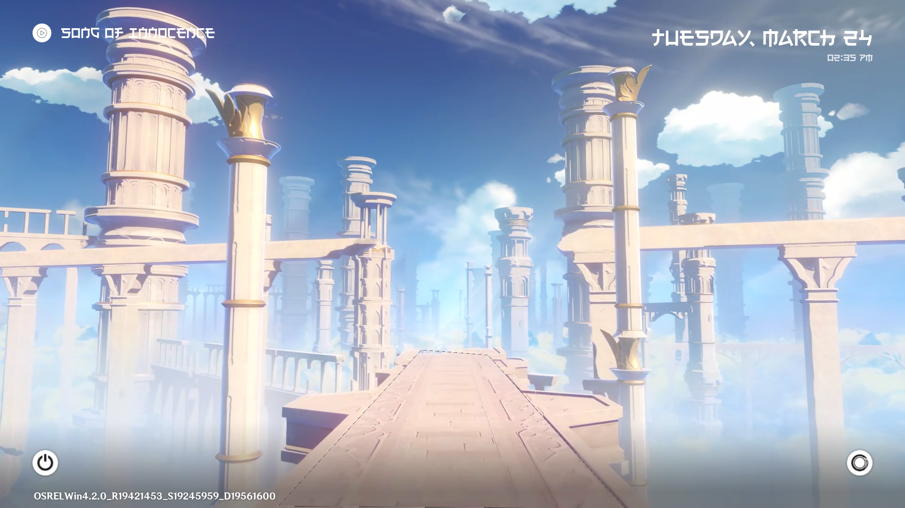
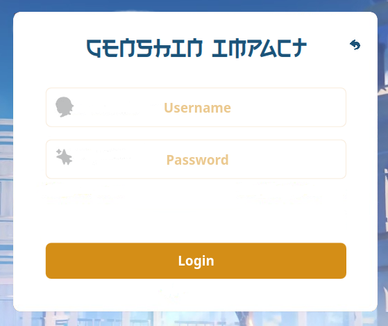
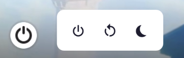
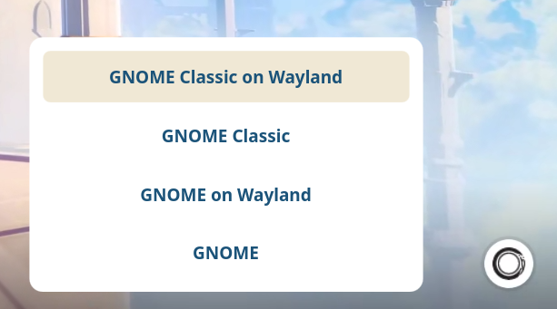

<div align="center">



# 🌌 Genshin Impact SDDM Theme

[](LICENSE)

**A customised fork of the Genshin Impact SDDM theme by [nicefaa6waa](https://github.com/nicefaa6waa/genshin-sddm-theme).**

[Report Bug](https://github.com/Emii-lia/genshin-sddm-theme-re/issues) · [Request Feature](https://github.com/Emii-lia/genshin-sddm-theme-re/issues)

</div>

---

## ✨ Features

It automatically detects the time of day on your OS to serve specific video backgrounds and animations.

| Feature | Description |
| :--- | :--- |
| **🕰️ Dynamic Backgrounds** | Changes automatically between **Morning**, **Day**, and **Night** video wallpapers. |
| **🖥️ HDPI Support** | Dynamic scaling that looks sharp on 1080p, 2K, and 4K monitors. |
| **🎵 Music Player** | Integrated player with custom song list support. |
| **🚪 Door Animations** | Unique transition animations upon login (Morning, Day, Night variants). |
| **⚙️ Customization** | Edit `theme.conf` to change colors, sounds, and settings. |

### 📸 Preview Gallery

| Login Screen | Power Menu |
| :---: | :---: |
|  |  |
| **Session Select** | **Background Variance** |
|  |  |

---

## 📦 Dependencies

Please install the required packages for your distribution before proceeding.

| Distribution | Install Command |
| :--- | :--- |
| **Arch Linux** <br> *(Manjaro, Artix, Endeavour)* | ```bash sudo pacman -S gst-libav phonon-qt5-gstreamer gst-plugins-base gst-plugins-good gst-plugins-bad gst-plugins-ugly qt5-quickcontrols2 qt5-graphicaleffects qt5-multimedia qt6-base xorg-xrandr --overwrite '*' ``` |
| **Debian / Ubuntu** <br> *(Kali, Pop!_OS, Mint)* | ```bash sudo apt-get install gstreamer1.0-libav qml-module-qtmultimedia libqt5multimedia5-plugins qml-module-qtquick-controls2 gstreamer1.0-plugins-good qt6-base-dev ``` |
| **Fedora** <br> *(RHEL, CentOS)* | ```bash sudo dnf install qt5-qtmultimedia qt5-qtgraphicaleffects qt5-qtquickcontrols2 gstreamer1-plugins-good gstreamer1-libav qt6-qtbase ``` |

---

## 🚀 Installation

### Option 1: Automatic Installer (Recommended)
The script will auto-detect your OS, install dependencies, download the heavy video files, and configure SDDM.

```bash
git clone [https://github.com/nicefaa6waa/genshin-sddm-theme.git](https://github.com/nicefaa6waa/genshin-sddm-theme.git)
cd genshin-sddm-theme
sudo ./install-sddm-theme.sh

```

### Option 2: Manual Installation

<details>
<summary><b>Click to expand manual instructions</b></summary>

1. **Clone the repository:**
```bash
git clone [https://github.com/nicefaa6waa/genshin-sddm-theme.git](https://github.com/nicefaa6waa/genshin-sddm-theme.git)

```


2. **Copy to themes directory:**
```bash
sudo cp -r genshin-sddm-theme /usr/share/sddm/themes/

```


3. **Download Background Videos:**
* Download the video assets from [Google Drive](https://drive.google.com/drive/folders/1Yz2GxV8uvZJM16YSbE2yPRMT58H5o0Bs?usp=drive_link).
* Unzip the contents into `/usr/share/sddm/themes/genshin-sddm-theme/backgrounds/`.


4. **Enable the Theme:**
Edit `/etc/sddm.conf` (or `/etc/sddm.conf.d/kde_settings.conf`):
```ini
[Theme]
Current=genshin-sddm-theme

```


</details>

### 🧪 Testing

> [!IMPORTANT]
> Always test the theme before logging out to avoid getting locked out of your system due to errors.

Run the following command to preview the theme in a window:

```bash
sddm-greeter --test-mode --theme genshin-sddm-theme

```

---

## Changes

- Custom Font (Electroharmonix) for Date, Time, and Current media title.
- Redesigned power menu (icons + popup layout).
- Redesigned login popup ( title + icons).
- Updated colour palette.
- Added new soundtracks.

## License

Same as upstream.

## Credits

* Original theme by [nicefaa6waa](https://github.com/nicefaa6waa/genshin-sddm-theme).
* **Disclaimer:** All video assets belong to HoYoverse. I do not own any of them.

